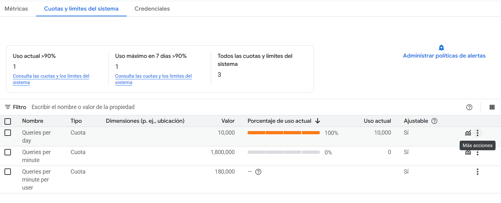

# YouTube API - Gestión de Cuotas

## ¿Qué es la cuota de YouTube API?

YouTube limita el uso de su API mediante un sistema de cuotas para evitar abusos y garantizar un uso justo del servicio. Cada proyecto API tiene asignada una cantidad diaria de "unidades" que se consumen con cada solicitud.

## Cuota Gratuita

### Límite diario predeterminado
- **10,000 unidades por día** (por proyecto)
- Se reinicia automáticamente cada día a **medianoche (hora del Pacífico - PT)**, las 09:00 AM en España peninsular (UTC-8 en invierno, UTC-7 en verano)
- No requiere tarjeta de crédito ni pago

### Costo de operaciones comunes

Cada tipo de operación consume diferentes cantidades de unidades:

| Operación | Costo en unidades | Descripción |
|-----------|-------------------|-------------|
| `search.list` | **100 unidades** | Buscar videos, canales o playlists |
| `videos.list` | 1 unidad | Obtener detalles de videos específicos |
| `channels.list` | 1 unidad | Obtener información de canales |
| `playlists.list` | 1 unidad | Listar playlists |
| `playlistItems.list` | 1 unidad | Listar items de una playlist |

## Consumo en Karaoke Party

### Por búsqueda
Cada vez que buscas una canción en la aplicación:
- Se ejecuta `search.list` = **100 unidades**
- Se solicitan 5 resultados máximo

### Cálculo de búsquedas disponibles
Con la cuota gratuita de 10,000 unidades:

$$10,000\text{ unidades} ÷ 100 \text{ unidades/búsqueda} = 100 \text{ búsquedas por día}$$


## Error "Quota Exceeded"

### ¿Qué significa?
```
The request cannot be completed because you have exceeded your quota.
```

Este error aparece cuando:
1. Has consumido las 10,000 unidades del día
2. Has hecho aproximadamente 100 búsquedas o más

### ¿Cuándo se reinicia?
- **Automáticamente a medianoche (Pacific Time)**, las 09:00 AM en España peninsular (UTC-8 en invierno, UTC-7 en verano)


### ¿Cómo puedo solicitar aumento de cuota? (Gratuito)
Google permite solicitar más cuota sin costo:

**Pasos:**
1. Ve a [Google Cloud Console](https://console.cloud.google.com)
2. Selecciona el proyecto asociado a tu API Key
3. Navega a **APIs & Servicios** → **YouTube Data API v3**
4. Haz clic en **Cuotas y límites del sistema**
5. Ve a la tabla de límites y da al icono de "Más acciones" (tres puntos) en la fila de "Queries per day" (ver captura)
   
6. Da a "Editar cuota" y haz clic en el enlace de "solicita una cuota mayor" para abrir el formulario de solicitud
7. Rellena el formulario con los detalles de tu uso y envíalo
8. Espera la respuesta de Google (puede tardar desde horas hasta días)

## Recursos adicionales

- [Documentación oficial de cuotas](https://developers.google.com/youtube/v3/getting-started#quota)
- [Calculadora de costos de API](https://developers.google.com/youtube/v3/determine_quota_cost)
- [Solicitar aumento de cuota](https://support.google.com/youtube/contact/yt_api_form)

## Preguntas frecuentes

**¿Puedo pagar para tener más cuota?**
No, YouTube no ofrece planes de pago para más cuota, pero puedes solicitar aumentos gratuitos.

**¿Compartir mi API key consume mi cuota?**
Sí, si compartes tu API key, cualquier búsqueda realizada con ella consumirá TU cuota.

**¿Puedo ver quién usa mi cuota?**
No, Google Cloud solo muestra el consumo total, no por usuario individual.

**¿Qué pasa si supero la cuota repetidamente?**
Google puede revisar tu cuenta, pero no hay penalizaciones automáticas si es uso legítimo.
